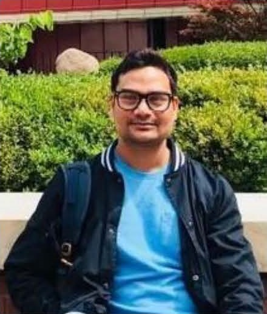

## About Me

I am a NIHR Dementia Fellow at the University of Oxford and Keele University, UK. Being a physiotherapist and epidemiologist, my research focuses on multimorbidity, ageing, frailty, musculoskeletal and neurological conditions, and chronic pain. Using large electronic health records, I explore disease trajectories, genetic associations, and treatment impacts, particularly in dementia, rheumatic diseases, and age-related conditions. With over a decade of experience across developing and developed countries primary care research and expertise in longitudinal data analysis, machine learning, pharmaco-epidemiology, and policy evaluation. Committed to ethical and equitable research, I aim to advance MLTC science to improve patient outcomes and inform healthcare strategies globally.
